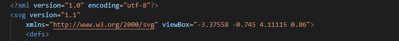

# AcpTrak Master

Drop in framework that enables connections of an AcpTrak system to a MpView Paper widget. Can also be used to power other extensions of functionality for a simple HMI commisioning/troubleshooting interface.

## Table of Contents
- [AcpTrak Master](#acptrak-master)
  - [Table of Contents](#table-of-contents)
  - [Features](#features)
  - [Known Current Limitations](#known-current-limitations)
  - [Getting Started](#getting-started)
    - [Prerequisites](#prerequisites)
    - [To Extend](#to-extend)
  - [Versions](#versions)
      - [Version 0.1](#version-01)
  - [Contributors](#contributors)

## Features
- Uses standard Paper widget for MpView
- Scalable for any system up to 150 shuttles
- Minimal configuration needed
- Expandable framework to add in your own functionality
- Manual control function block (tmShuttleControl)
  - Provides Elastic Move Absolute and Additive commands while also being able to see current shuttle information
  
## Known Current Limitations
- Unknown load on physical system
- No user data connections
- Plenty more I'm sure!
  
## Getting Started

- Add tmCore function block to a task
- Connect track assembly
- Connect McAcpTrakAssemblyMonData variable
- Tie SVG view box parameters to inputs on Core FB
 
 
- Modify any constants as needed to reflect your application (string length, max shuttles etc etc)
- Tie output SvgContent and SvgTransform to existing Paper Widget

### Prerequisites

Built on 
- AS 4.7.5.60
- AR C4.72
- MpMotion 5.12.0
- MpView 5.12.0

It is possible and likely this system will work on other versions.

**Core FB and all associated should be called in low priority task classes with high tolerances.**

### To Extend

Coming soon?

## Versions

#### Version 0.1
* First public release

## Contributors

* **Connor Trostel** - *Initial work*

